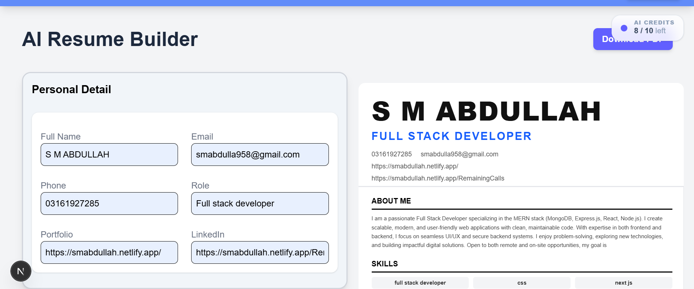
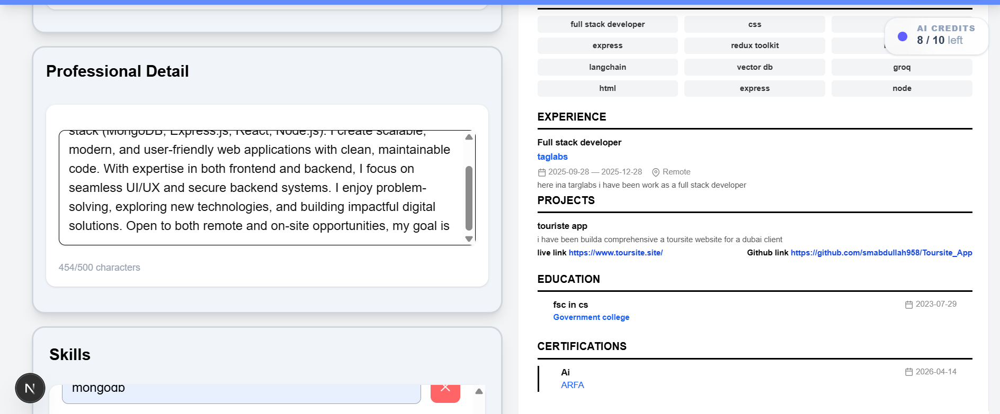
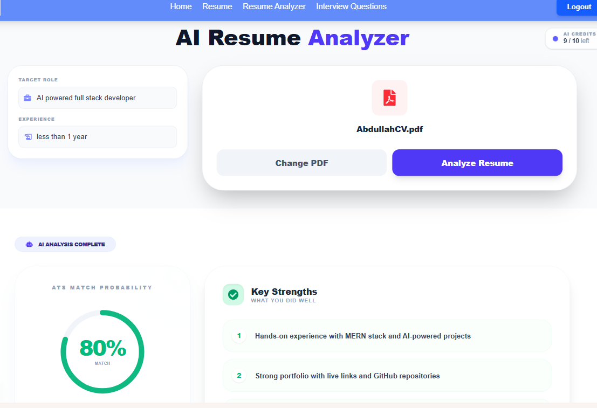
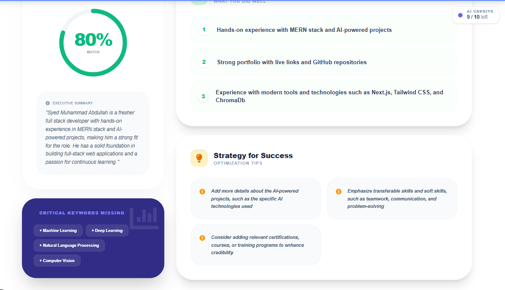
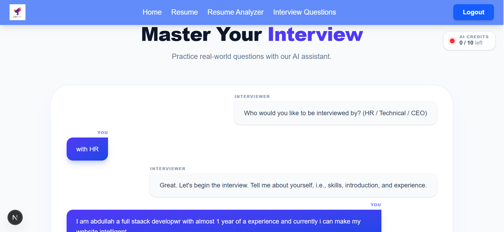

# 🚀 AI Career Assistant

An AI-powered web application that helps users **build, analyze, and improve their careers** using intelligent tools like resume generation, ATS-based resume analysis, and interview preparation.

---

## ✨ Features

- 🧠 **AI Resume Generator** – Generate professional resumes instantly
- 📄 **AI Resume Analyzer (ATS Based)** – Upload PDF resumes and get smart feedback
- 🎯 **Role-Based Suggestions** – Tailored improvements based on job role
- 💼 **Interview Preparation** – Practice interview questions powered by AI
- 🔐 **Authentication System** – Secure login/signup using JWT
- 📊 **Usage Tracking** – Daily usage limits & credits system
- ⚡ **Fast & Responsive UI**

---

## 🛠️ Tech Stack

### Frontend

- Next.js (React)
- Redux Toolkit
- Tailwind CSS

### Backend

- Node.js
- Express.js
- MongoDB (Mongoose)

### AI Integration

- Groq API
- LangChain

### Other Tools

- Multer (File Upload)
- JWT Authentication

---

## 📂 Project Structure

```
AI-Career-Assistant/
│
├── Backend/
│   ├── Config/
│   ├── Controller/
│   ├── MiddleWare/
│   ├── Model/
│   ├── Prompts/
│   ├── Routes/
│   ├── Services/
│   ├── Validator/
│   └── Server.js
│
├── Frontend/
│   ├── Component/
│   ├── Features/
│   ├── Libraries/
│   ├── app/
│   └── public/
│
└── README.md
```

---

## ⚙️ Installation & Setup

### 1️⃣ Clone Repository

```bash
git clone https://github.com/smabdullah958/AI-Career-Assistant.git
cd AI-Career-Assistant
```

---

## ▶️ Frontend

```bash
cd Frontend
npm install
```

Create `.env` file inside **Frontend**:

```env
NEXT_PUBLIC_BackendURL=your_backend_url
```

Run frontend:

```bash
npm run dev
```

---

## ▶️ Backend

```bash
cd Backend
npm install
```

Create `.env` file inside **Backend**:

```env
PortNo=5000
connection=your_mongodb_connection
SecretKey=your_jwt_secret
Frontend=your_frontend_url
Groq_API=your_groq_api_key
```

Run backend:

```bash
npm start
```

---

## 🔄 How It Works

### 🧠 1. AI Resume Generator

1. User fills a form (skills, education, experience)
2. Data is sent to backend
3. AI (Groq + LangChain) generates a professional resume
4. Resume is displayed and can be downloaded as PDF




---

### 📄 2. AI Resume Analyzer (ATS Based)

1. User uploads a resume (PDF)
2. Backend extracts text from PDF
3. AI analyzes resume based on:
   - Job role
   - Experience level

4. Returns:
   - Resume score
   - Weak areas
   - Improvement suggestions




---

### 💼 3. Interview Preparation

1. User selects role / field
2. AI generates interview questions
3. User can practice answers
4. Helps improve confidence and preparation



---

### 🔐 4. Authentication System

- User can Sign Up / Login
- JWT-based authentication
- Secure routes for protected features

---

### 📊 5. Usage Tracking System

- Each user has limited daily credits
- Middleware tracks API usage

---

## 📧 Contact

- 🌐 Portfolio: https://smabdullah.netlify.app/
- 💻 GitHub: https://github.com/smabdullah958

---

## ⭐ Support

If you like this project, give it a ⭐ on GitHub!
